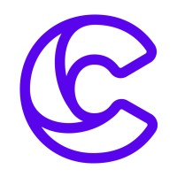

# golangzg
Golang Zagreb meetup group documents

### Last meetup - **GoTalks 28.11.2023.**   
- [RISC-V i Golang](assets/2023/11/GoMeetup-2023-11-28.pdf)
by [Bruno Banelli](https://www.linkedin.com/in/brunobanelli/)
- [Go news](assets/2023/11/GoNews_2023_11_28.pdf)
by [Zlatko Bratkovic](https://www.linkedin.com/in/bratkoviczlatko/)

### History
[meetup talks history](talks.md)

### Code Examples
[Hack Table](hacktable)
