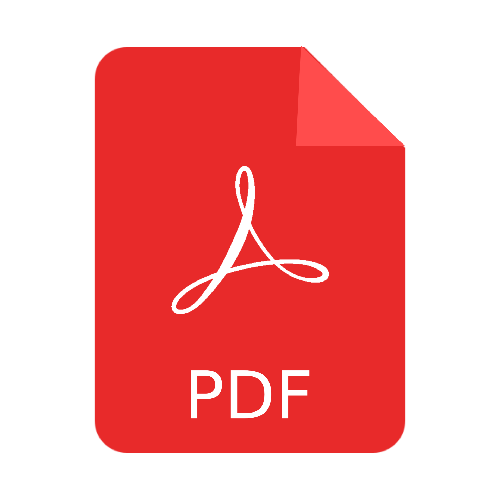

# golangzg
Golang Zagreb meetup group documents

### Last Meetup - **GoTalks 17.12.2024.** 
- Go News by [Zlatko Bratkovic](https://www.linkedin.com/in/bratkoviczlatko/) 
- Go Internationalization (i18n) by [Branko Zečević](https://www.linkedin.com/in/bzecevic/)  ([Examples](assets/2024/12/))

### History
[Meetup Talks History](talks.md)

### Code Examples
[Hack Table](hacktable)
