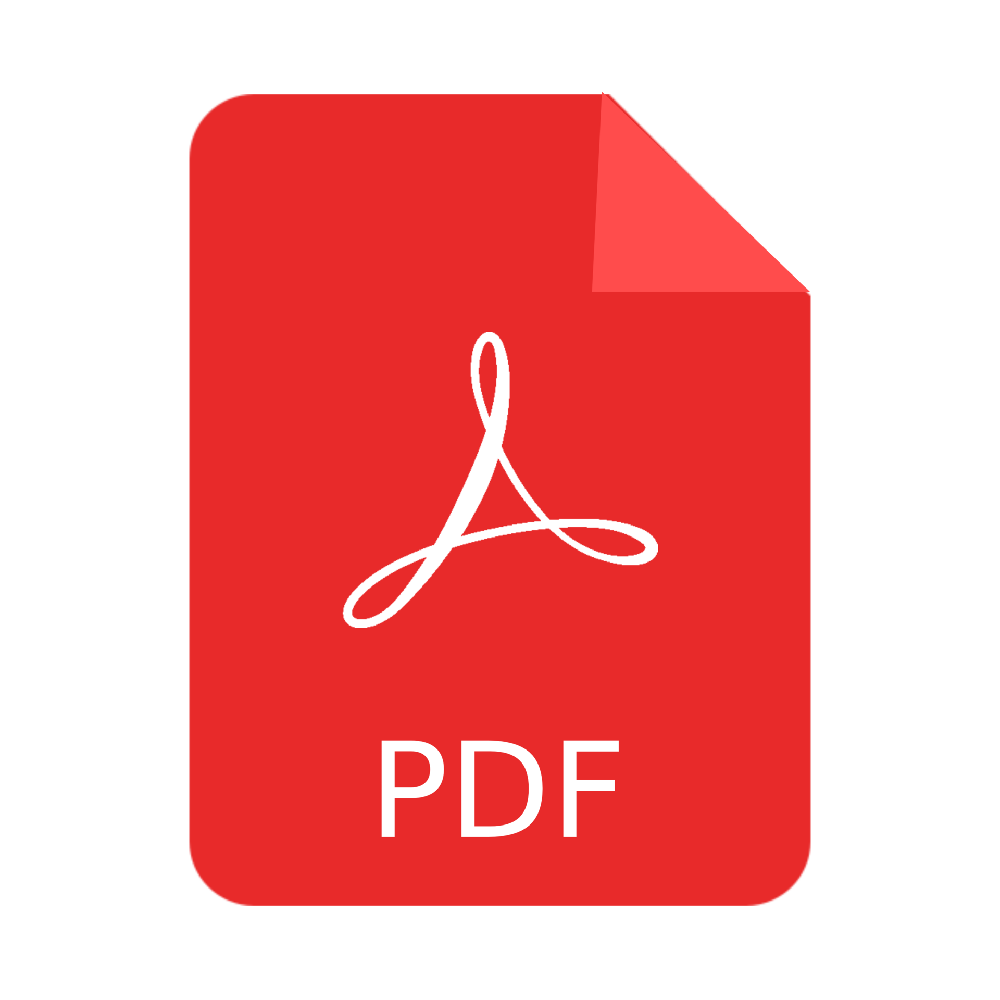

# Meetup Talks

## 2025

### **GoTalks 24.6.2025.** [](https://www.meetup.com/golang-zg/events/308525129/)
- **GOing Live - Deploying your first app the right way** 
by [Josip Igrec](https://www.linkedin.com/in/josip-igrec/)


### **GoTalks 27.05.2025.** [](https://www.meetup.com/golang-zg/events/307898101)
- **Go modules and packages**
by [Zlatko Bratković](https://www.linkedin.com/in/bratkoviczlatko/) [](assets/2025/05/meetup-2025-05.pdf)
- local run
  ```sh
  go install github.com/oktalz/present@latest
  present --admin-pwd-disable -g github.com/golanghr/golangzg -d assets/2025/05
  ```

### **GoTalks 29.4.2025.** [](https://www.meetup.com/golang-zg/events/307302311/)
- **Building Desktop Apps with Go**
by [Branko Zečević](https://www.linkedin.com/in/bzecevic/) [](assets/2025/04/POINTER-Open-source-S007-Prezentacija-Desktop-Apps-GolangZG-GoTalks-2025-04-en.pdf)

### **GoTalks 27.03.2025.** [](https://www.meetup.com/golang-zg/events/306718932/) [](https://www.youtube.com/watch?v=6z9xuje4QXQ)
- **Golang from the perspective of .Net developer**
by [Dražen Mrvoš](https://www.linkedin.com/in/dmrvos/) [](assets/2025/03/Zagreb-GoTalks-Meetup-27_3.pdf)
- **Async service communication**
by [Antonio Krstičević](https://www.linkedin.com/in/antoniokristicevic/) [](assets/2025/03/Zagreb-GoTalks-Meetup-27_3.pdf)

### **GoTalks 25.02.2025.** [](https://www.meetup.com/golang-zg/events/306133678/) [](https://www.youtube.com/watch?v=SdbGc_vCg5g)
- **Go 1.24**
by [Zlatko Bratković](https://www.linkedin.com/in/bratkoviczlatko/) [](assets/2025/02/presentation.pdf)
- local run
  ```sh
  go install github.com/oktalz/present@latest
  present --admin-pwd-disable -g github.com/golanghr/golangzg -d assets/2025/02
  ```
- HTPPS - deep dive
by [Bruno Banelli](https://www.linkedin.com/in/brunobanelli/) [](assets/2025/02/GoMeetupZg-2025-02-HTTPS-deep-dive.pdf)

### **GoTalks 30.01.2025.** [](https://www.meetup.com/golang-zg/events/305823027) [](https://www.youtube.com/watch?v=C8t7IAM3Nac)
- **Go Developer Survey, writing http server**
by [Zlatko Bratković](https://www.linkedin.com/in/bratkoviczlatko/) [](assets/2025/01/presentation.pdf)
- local run
  ```sh
  go install github.com/oktalz/present@latest
  present --admin-pwd-disable -g github.com/golanghr/golangzg -d assets/2025/01
  ```

## 2024

### **GoTalks 17.12.2024.** [](https://www.meetup.com/golang-zg/events/305032788/)
- **Go News**
by [Zlatko Bratković](https://www.linkedin.com/in/bratkoviczlatko/) [](assets/2024/12/meetup-2024-12.pdf)
- **Go Internationalization (i18n)**
by [Branko Zečević](https://www.linkedin.com/in/bzecevic/) [](assets/2024/12/POINTER-Open-source-S006-Prezentacija-I18N-GolangZG-GoTalks-2024-12-en.pdf) ([Examples](assets/2024/12/))

### **GoTalks 01.10.2024.** [](https://www.meetup.com/golang-zg/events/303525605/) [](https://www.youtube.com/watch?v=KV-3WZr0dGM)
- **Go 1.23**
by [Zlatko Bratković](https://www.linkedin.com/in/bratkoviczlatko/) [](assets/2024/10/assets/Go-meetup-10-2024.pdf)
- present - alternative to presentation tools written in Go
by [Zlatko Bratković](https://www.linkedin.com/in/bratkoviczlatko/)
- local run
  ```sh
  go install github.com/oktalz/present@v1.0.0
  present --admin-pwd-disable -g github.com/golanghr/golangzg -d assets/2024/10
  ```

### **GoTalks 18.6.2024.** [](https://www.meetup.com/golang-zg/events/301567254/)
- **Creating PDF documents with Go**
by [Branko Zečević](https://www.linkedin.com/in/bzecevic/) [](assets/2024/06/POINTER-Open-source-S005-Prezentacija-PDF-GolangZG-GoTalks-2024-06-en.pdf) ([Examples](assets/2024/06/))

### **GoTalks 21.5.2024.** [](https://www.meetup.com/golang-zg/events/301005589/) [](https://youtu.be/Mk4yzDixDgc)
- **Building Terminal User Interfaces with BubbleTea**
by [Marin Barišić](https://www.linkedin.com/in/barisicmarin/) [](assets/2024/05/GoMeetup%20-%20Zagreb%20-%202024-05-21%20-%20TUI%20Apps%20with%20BubbleTea.pptx.pdf)


### **GoTalks 9.4.2024.** [](https://www.meetup.com/golang-zg/events/300149656/) [](https://youtu.be/beCVwhHiH1E)
- **Web Sockets in Microservice architecture**
by Asseco

### **GoTalks 20.2.2024.** [](https://www.meetup.com/golang-zg/events/299180885/) [](https://youtu.be/7fd7-w2oa7k)
- **Go 1.22**
by [Zlatko Bratković](https://www.linkedin.com/in/bratkoviczlatko/)

### **GoTalks 30.01.2024.** [](https://www.meetup.com/golang-zg/events/298719089/) [](https://youtu.be/kKDWa37bhEw)
- **Go tools - govulncheck, go-licenses, task**
by [Zlatko Bratković](https://www.linkedin.com/in/bratkoviczlatko/) [](assets/2024/01/GoMeetup-2024-01.pdf)

## 2023

### **GoTalks 28.11.2023.** [](https://www.meetup.com/golang-zg/events/297444887/) [](https://youtu.be/qg3fhXN6kFs)
- [RISC-V i Golang](assets/2023/11/GoMeetup-2023-11-28.pdf)
by [Bruno Banelli](https://www.linkedin.com/in/brunobanelli/)
- [Go news](assets/2023/11/GoNews_2023_11_28.pdf)
by [Zlatko Bratković](https://www.linkedin.com/in/bratkoviczlatko/)

### **GoTalks 31.10.2023.** [](https://www.meetup.com/golang-zg/events/296928055/) [](https://youtu.be/bdsGTWcurkk)
- [Processing spreadsheets in Go](assets/2023/10/POINTER-Open-source-S003-Prezentacija-Go-Meetup-2023-10-en.pdf)
by [Branko Zečević](https://www.linkedin.com/in/bzecevic/)
- [Examples](assets/2023/10/)

### **GoTalks 26.09.2023.** [](https://www.meetup.com/golang-zg/events/296122228/) [](https://youtu.be/kAwKnqyPxPc)
- [Web scrapping and different ideas about UI (do we need it)](https://github.com/oktalz/go-meetup-2023-09-26/)
by [Zlatko Bratković](https://www.linkedin.com/in/bratkoviczlatko/)

### **Go DrinkUp 25.07.2023.** [](https://www.meetup.com/golang-zg/events/294880494/)
- Drinkup

### **GoTalks 20.06.2023.** [](https://www.meetup.com/golang-zg/events/294158846/)
- [Go ASM - deep dive](assets/2023/06/GoMeetup%20-%20Zagreb%20-%202023-06-20.pdf)
by [Bruno Banelli](https://www.linkedin.com/in/brunobanelli/)

### **GoTalks 23.05.2023.** [](https://www.meetup.com/golang-zg/events/293588389/)
- [Benchmarking: Interface vs Generics](https://docs.google.com/presentation/d/1VDOhXDVzhYGu-rJfvKTg5in5aZosC0RSsJLLRgVga6M/edit?usp=sharing)
by [Zlatko Bratković](https://www.linkedin.com/in/bratkoviczlatko/)

### **GoTalks 11.04.2023.** [](https://www.meetup.com/golang-zg/events/292548923/)
- **TinyGo - može li blue collar jezik raditi na 133 MHz i stotinama kilobajta RAM-a**
by [Bruno Banelli](https://www.linkedin.com/in/brunobanelli/)

### **GoTalks 21.03.2023.** [](https://www.meetup.com/golang-zg/events/292109948/)
- [Code coverage: Može li 100% code coverage garantirati sreću i zadovoljstvo](https://docs.google.com/presentation/d/19BT4dJZGT6MklNTk_1VB711mmlx0OFfBpsJD2eHP4xs/edit?usp=sharing)
by [Zlatko Bratković](https://www.linkedin.com/in/bratkoviczlatko/)

### **GoTalks 21.02.2023.** [](https://www.meetup.com/golang-zg/events/292548923/)
- **Optimising speed, security and flexibility of JWT with Go**
by [Bruno Banelli](https://www.linkedin.com/in/brunobanelli/)


## 2022

### **GoTalks 15.11.2022.** [](https://www.meetup.com/golang-zg/events/289685521/)
- **Go Offensive Building Blocks**
by Vlatko Kosturjak

### **GoTalks 3.10.2022.** [](https://www.meetup.com/golang-zg/events/288520286/)
- **How Go helps us process millions of phone calls per day and detect spam**
by Zvonimir Radoš

### **GoTalks 5.7.2022.** [](https://www.meetup.com/golang-zg/events/286710728/)
- **Testiranje u Go-u**
by [Zlatko Bratković](https://www.linkedin.com/in/bratkoviczlatko/)

### **GoTalks 26.4.2022.** [](https://www.meetup.com/golang-zg/events/285411429/)
- **Go 1.18, Generics, Fuzzing, ...**
by [Zlatko Bratković](https://www.linkedin.com/in/bratkoviczlatko/)

### **GoTalks 22.3.2022.** [](https://www.meetup.com/golang-zg/events/284627012/)
- **Data contracts using Protocol Buffers**
by Mislav Mandarić

### **GoTalks 25.1.2022.** [](https://www.meetup.com/golang-zg/events/283356786/)
- **Optimizacija koda**
by [Zlatko Bratković](https://www.linkedin.com/in/bratkoviczlatko/)


## 2021

### **GoTalks 10.11.2021.** [](https://www.meetup.com/golang-zg/events/281873898/)
- **12 godina Go-a**
by [Zlatko Bratković](https://www.linkedin.com/in/bratkoviczlatko/)

### **GoTalks 28.9.2021.** [](https://www.meetup.com/Golang-ZG/events/280925668/)
- Drinkup

### **GoTalks 20.4.2021.** [](https://www.meetup.com/golang-zg/events/277547065/)
- **Go embed u praksi**
by [Zlatko Bratković](https://www.linkedin.com/in/bratkoviczlatko/)

### **GoTalks 23.2.2021.** [](https://www.meetup.com/golang-zg/events/276446045/)
- **Go 1.16**
by [Zlatko Bratković](https://www.linkedin.com/in/bratkoviczlatko/)


## 2020

### [GoTalks 26.11.2020.](https://www.meetup.com/Golang-ZG/events/274708875/)
- **Komunikacija browsera i Go aplikacije, \
može li Javascript pozivati Go funkcije na backend programu**
by [Zlatko Bratković](https://www.linkedin.com/in/bratkoviczlatko/)

### [GoTalks 27.10.2020.](https://www.meetup.com/Golang-ZG/events/273956175/)
- **Golang u sysops svijetu**
by [Dinko Korunić](https://twitter.com/dkorunic)

### [GoTalks 22.09.2020.](https://www.meetup.com/Golang-ZG/events/273209103/)
- **Service mesh**
by [Neven Miculinić](https://www.linkedin.com/in/nmiculinic/)

### [GoTalks 26.05.2020.](https://www.meetup.com/Golang-ZG/events/270725353/)
- **Kako si olakšati dijagnostiku i debugiranje Golang mikroservisa**
by Matija Salopek

### [GoTalks 21.04.2020.](https://www.meetup.com/Golang-ZG/events/269914818/)  [](https://youtu.be/pBrPGmJUUlk)
- **Kubernetes Operators: Safety First Through Model Checkers**
by [Neven Miculinić](https://www.linkedin.com/in/nmiculinic/)

### [GoTalks 18.02.2020.](https://www.meetup.com/Golang-ZG/events/268566279/)
- **Slanje Push notifikacija iz Goa**
by [Maja Trepšić Kušt](https://www.linkedin.com/in/maja-trepsic/)

### [GoTalks 30.01.2020.](https://www.meetup.com/Golang-ZG/events/267900978/)
- **Behavior-driven development & Cucumber for Go**
by Zvonimir Bošnjak


## 2019

### [GoTalks 10.12.2019.](https://www.meetup.com/Golang-ZG/events/265507369/)
- **Go moduli u dubinu**
by [Zlatko Bratković](https://www.linkedin.com/in/bratkoviczlatko/)

### [GoTalks 19.11.2019. Go 10th anniversary. #GoTurns10](https://www.meetup.com/Golang-ZG/events/265507312/)
- [10th anniversary of the Go release](https://talks.godoc.org/github.com/matejb/talks/2019/Go10years/Go10years-v2.slide#1)
by [Matej Baćo](https://twitter.com/matejbaco)

### [GoTalks 24.9.2019.](https://www.meetup.com/Golang-ZG/events/264730683)
- [go generate - the good, the bad, the better](https://github.com/oktalz/golangzg/blob/Meetup-20190924/presentations/2019-09-24/go-generate-principle.pdf)
by [Zlatko Bratković](https://www.linkedin.com/in/bratkoviczlatko/)
- [Community news / Go 1.13](https://talks.godoc.org/github.com/matejb/talks/2019/Go113/Go113.slide#1)
by [Matej Baćo](https://twitter.com/matejbaco)

### [GoTalks 13.6.2019.](https://www.meetup.com/Golang-ZG/events/262003258/)
- [Go on AWS Lambda](https://talks.godoc.org/github.com/matejb/talks/2019/GoOnAwsLambda/GoOnAwsLambda.slide#1)
by [Matej Baćo](https://twitter.com/matejbaco)

### [GoTalks 16.5.2019.](https://www.meetup.com/Golang-ZG/events/261384408/)
- Drinkup

### [GoTalks 11.4.2019.](https://www.meetup.com/Golang-ZG/events/260283013/)
- Drinkup

### [GoTalks 14.3.2019.](https://www.meetup.com/Golang-ZG/events/259667708)
- [Hack Table](https://github.com/golanghr/golangzg/tree/master/hacktable#2019-03)

### [GoTalks 14.2.2019.](https://www.meetup.com/Golang-ZG/events/258868806/)
- Drinkup

### [GoTalks 1/19](https://www.meetup.com/Golang-ZG/events/258357473/) January 31, 2019
- [Hack Table](https://github.com/golanghr/golangzg/tree/master/hacktable#2019-01)


## 2018

### [GoTalks 12/18](https://www.meetup.com/Golang-ZG/events/257008957/) December 10, 2018
- **Golang race detection**
by [Neven Miculinić](https://www.linkedin.com/in/nmiculinic/)

### [GoTalks 11/18](https://www.meetup.com/Golang-ZG/events/256537975/) November 26, 2018
- [Uvod u servise sa go-kitom](https://github.com/mutantkeyboard/uvod-u-gokit)
by [Antonio Nesić](https://twitter.com/exo23)

### [GoTalks 10/18](https://www.meetup.com/Golang-ZG/events/lsrsjqyxnbhc/) October 25, 2018
- **Interakcija sa hardwerom na aplikacijskoj razini**
by [Ljubo Čanić](https://twitter.com/ljubo_canic)

### [GoTalks 9/18](https://www.meetup.com/Golang-ZG/events/254413467/) September 13, 2018
- [New in Go v1.11](https://talks.godoc.org/github.com/matejb/talks/2018/go1.11/go1.11.slide#1)
by [Matej Baćo](https://twitter.com/matejbaco)

### [GoTalks 6/18](https://www.meetup.com/Golang-ZG/events/251673885/) June 19, 2018
- [Go projects structures](https://github.com/matejb/gops)
by [Matej Baćo](https://twitter.com/matejbaco)

### [GoTalks 5/18](https://www.meetup.com/Golang-ZG/events/250651450/) May 22, 2018
- [Image Recognition SaaS](https://talks.godoc.org/github.com/MarinX/talks/go-meetup-tensorflow/main.slide#1)
([video](https://www.youtube.com/watch?v=fOfcF2Z_I58))
by [Marin Basic](https://twitter.com/marin02basic)

### [GoTalks #17](https://www.meetup.com/Golang-ZG/events/249627022/) April 26, 2018
- [go:generate](https://slides.com/nmiculinic/go-generate/#/)
([video](https://www.youtube.com/watch?v=R_qQnsyNMNw))
by [Neven Miculinić](https://www.linkedin.com/in/nmiculinic/)

### [GoTalks #16](https://www.meetup.com/Golang-ZG/events/248534214/) March 20, 2018
- [Go i WASM - buducnost weba](https://github.com/mutantkeyboard/GoTalk)
([video](https://www.youtube.com/watch?v=-BS1fJ2E4ms))
by [Antonio Nesić](https://twitter.com/exo23)

### [GoTalks #15](https://www.meetup.com/Golang-ZG/events/247644001/) February 26, 2018
- [Go 1.10](https://talks.godoc.org/github.com/dvrkps/talks/go110/talk.slide#1)
([video](https://www.facebook.com/matejbaco/videos/g.724216327694602/10156176052968874))
by [Davor Kapša](https://twitter.com/dvrkps)

### [GoTalks #14](https://www.meetup.com/Golang-ZG/events/246613216/) January 23, 2018
- [Streamanje glazbe pomoću Go-a](https://speakerdeck.com/senko/streamanje-glazbe-pomocu-go-a)
([video](https://www.facebook.com/matejbaco/videos/g.724216327694602/10156078276373874))
by [Senko Rašić](https://twitter.com/senkorasic)


## 2017

### [GoTalks #13](https://www.meetup.com/Golang-ZG/events/245358345/) December 7, 2017
- [dotGo2017](https://github.com/minus5/dotGo2017)
by [Marin Prcela](https://twitter.com/mprcela)

### [GoTalks #11](https://www.meetup.com/Golang-ZG/events/244226216/) October 26, 2017
- [math/bits](https://talks.godoc.org/github.com/dvrkps/talks/mathbits/talk.slide#1)
by [Davor Kapša](https://twitter.com/dvrkps)

### [GoTalks #10](https://www.meetup.com/Golang-ZG/events/243038475/) September 13, 2017
- [Go i blockchain](https://docs.google.com/presentation/d/1RybQluA3SbrM0PMgxmUSTWxyESTcXL9eFLSUvexDQSI/edit#slide=id.p)
by [Ivan Voras](https://twitter.com/ivoras)

### [GoTalks #9](https://www.meetup.com/Golang-ZG/events/240548481/) June 12, 2017
- **Simple and effective**
by [Antonio Nesić](https://twitter.com/exo23)

### [GoTalks #8](https://www.meetup.com/Golang-ZG/events/239817535/) May 24, 2017
- [Gomobile: gophers in the land of Android](https://www.slideshare.net/JovicaPopovic/gomobile-gophers-in-the-land-of-android)
by [Jovica Popović](https://twitter.com/jpop_32)

### [GoLang Talks #6](https://www.meetup.com/Golang-ZG/events/237499164/) March 9, 2017
- [Go 1.8](http://talks.godoc.org/github.com/dvrkps/talks/go18/talk.slide#1)
by [Davor Kapša](https://twitter.com/dvrkps)


## 2016

### [GoLang Talks #5](https://www.meetup.com/Golang-ZG/events/235292107/) November 18, 2016
- **Concurrent worker pools**
by [Ljubo Čanić](https://twitter.com/ljubo_canic)

- [Buying p0rn with Go](http://talks.godoc.org/github.com/marinx/talks/buying-p0rn-with-go/presentation.slide#1)
by [Marin Bašić](https://twitter.com/marin02basic)


### [GoLang Talks #4](https://www.meetup.com/Golang-ZG/events/230471563/) April 25, 2016
- [Upgrading Resque the Go way](http://go-talks.appspot.com/github.com/Aorioli/talks/resque/presentation.slide#1)
by [Adriano Orioli](https://twitter.com/TheOrioli)


### [GoLang Talks #3](https://www.meetup.com/Golang-ZG/events/229616950/) March 30, 2016
- [Basics of Microservice architecture](http://talks.godoc.org/github.com/MatejB/talks/2016/basics-of-microservice-architecture.slide#1)
by [Matej Baćo](https://twitter.com/matejbaco)


## 2015

### [GoLang Talks #1](https://www.meetup.com/Golang-ZG/events/221578834/) April 27, 2015
- [Praktični Go](https://github.com/irumiha/preza)
by [Igor Rumiha](https://twitter.com/irrummi)
